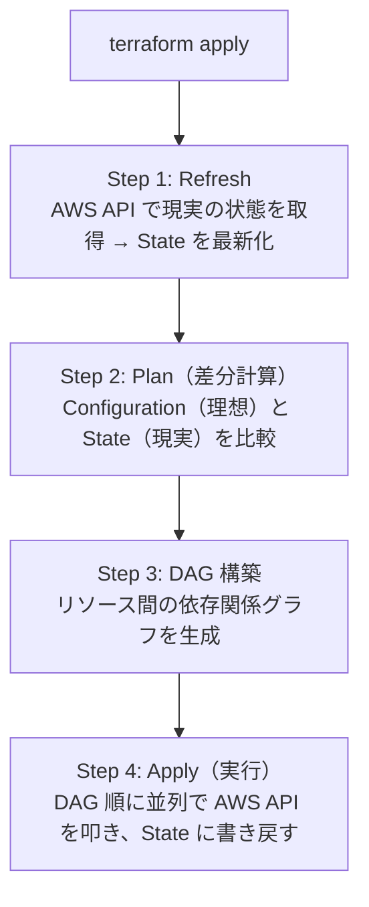
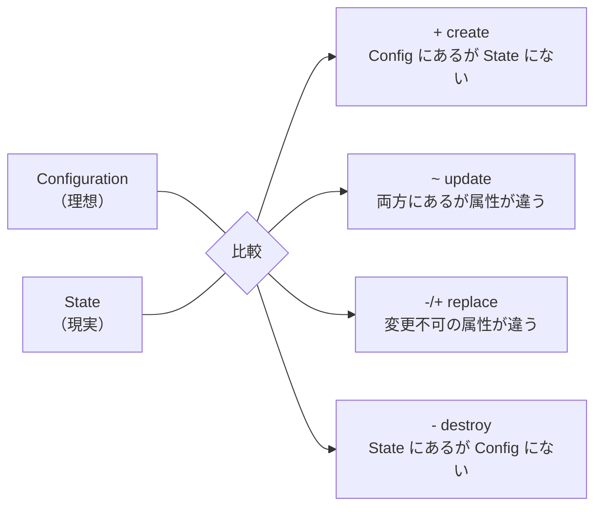
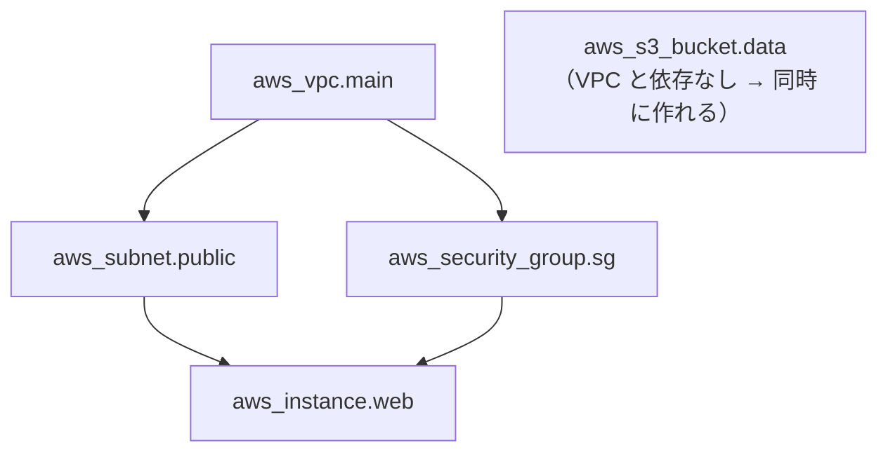

# [[Terraform Apply]]

## `apply` とは

`.tf` ファイルに宣言した理想の状態と、State が記録している現実の状態を比較し、その差分を AWS API 経由で適用するコマンド。Terraform の中核にあたる。

---

## `apply` の内部処理 — 4 つのステップ



### Step 1: Refresh

AWS リソースの現在の状態を API 経由で取得し、State を最新化する。誰かがコンソールから手動でタグを変えていたら、ここで State に反映される。「Terraform が知っている現実」と「本当の現実」のズレを埋める工程。

### Step 2: Plan（差分計算）

Configuration（理想）と State（現実の記録）を突き合わせ、各リソースに対するアクションを決定する。



**replace が最も危険**。例えば DynamoDB のテーブル名を変更すると、テーブルは削除→再作成になり、データが消える。ただし plan で `-/+ replace` と明示されるため、事前に気づける。

### Step 3: DAG（依存関係グラフ）構築

Terraform はリソース間の参照関係を解析し、有向非巡回グラフ（DAG）を構築する。

```hcl
resource "aws_vpc" "main" {
  cidr_block = "10.0.0.0/16"
}

resource "aws_subnet" "public" {
  vpc_id     = aws_vpc.main.id    # ← ここで依存関係が生まれる
  cidr_block = "10.0.1.0/24"
}
```



依存関係のないリソースは並列に処理される。`depends_on` で明示的に依存を記述することもできるが、大半は自動推論で十分。

### Step 4: Apply（実行）

DAG に基づいて、依存関係がないリソースは並列に、依存があるものは順番に作成・更新・削除する。デフォルトの並列度は 10 で、`-parallelism=N` で変更可能。

#### 1 リソースの適用ライフサイクル

**Create の場合：**

1. Provider が AWS API を呼ぶ（例: `CreateTable`）
2. API が非同期なら、Provider がポーリングで完了を待つ（DynamoDB なら `DescribeTable` で `ACTIVE` になるまで）
3. 完了したら、API レスポンスから得た属性（ARN, ID 等）を State に書き込む
4. この属性が他リソースから `aws_dynamodb_table.xxx.arn` として参照される

**Update の場合：**

State の現在値と Config の理想値の差分属性だけを API に送る。タグだけ変えたなら `TagResource` だけ叩く。

**Replace（破壊的変更）の場合：**

デフォルトは **destroy-then-create**（先に消して再作成）。ダウンタイムが発生するため、`lifecycle` ブロックで変更できる。

```hcl
resource "aws_instance" "web" {
  # ...
  lifecycle {
    create_before_destroy = true
  }
}
```

---

## Ctrl+C で中断した場合の挙動

Terraform は Graceful Shutdown を実装している。

```
1回目の Ctrl+C → 実行中のリソース操作が終わるまで待って停止
2回目の Ctrl+C → 強制終了（危険）
```

### 強制終了で起こりうること

- **孤児リソース** — AWS にはリソースが作られたが、State に記録されていない
- **ロック未解放** — DynamoDB のロックが解放されず、次回 apply 時に `terraform force-unlock` が必要になる

### なぜ「ある程度」安全か

Terraform は**各リソースの操作が完了するたびに State を書き込む**。10 個中 7 個目で中断しても、完了した 6 個は State に正しく記録されている。中途半端になるのは「その瞬間に処理中だったリソース」だけ。

### 孤児リソースの対処法

**`terraform import`** — AWS 上に存在するリソースを後から State に取り込む。

```bash
terraform import aws_s3_bucket.my_bucket my-bucket-name
```

データを持つリソース（DynamoDB テーブル、RDS 等）はこちら一択。

**手動削除** — リソースが不要なら AWS コンソールか CLI で削除し、再度 `apply` すれば作り直される。空の S3 バケットや Security Group はこちらが早い。

### ロック未解放の対処

```bash
terraform force-unlock <LOCK_ID>
```

実行前に、チームの誰も apply を実行していないことを必ず確認する。

---

## エラー時の挙動 — ロールバックしない世界

CloudFormation は「全部成功するか、全部戻すか」のトランザクション的思想。Terraform は**「できたところまで進めて、失敗したら止まる」部分適用の思想**。

```
10 リソースを apply:
  1〜7: 成功 → State に記録済み、そのまま残る
  8:    API エラーで失敗
  9〜10: 未実行

再度 apply → 残り 3 個 + 失敗した 1 個の再試行が走る
```

これが安全なのは、**同じ `apply` を何度叩いても理想状態に収束する（冪等性）**ため。AWS API の多くは冪等性キーをサポートしており、Provider もそれを活用している。

---

## Plan で防げるエラーと Apply でしか出ないエラー

### Plan が検出できるもの（静的解析）

- HCL の構文エラー
- 依存関係の循環（A→B→C→A）
- 型の不一致（number 型に string を渡す等）
- 必須属性の欠落
- 存在しないリソース・アウトプットの参照

これらは「AWS に問い合わせるまでもなく間違っている」もの。

### Apply でしか出ないもの（ランタイムエラー）

- **名前の重複** — S3 バケット名がグローバルで既に使われている
- **IAM 権限不足** — 実行ロールに Write 系権限がない
- **クォータ超過** — VPC 上限 5 個、Lambda 同時実行数上限等
- **外部依存の制約** — Terraform 管理外のリソースが依存している
- **API の一時障害** — AWS API が 5xx を返す
- **Eventually Consistency** — IAM ポリシー作成直後に Lambda にアタッチすると伝播が間に合わない

**Plan はコンパイル、Apply はランタイム**と考えると分かりやすい。コンパイルが通ってもランタイムエラーは出る。

### 頻度の実感

プロジェクト初期やリソースを大量追加するフェーズでは、権限不足やクォータ超過は普通に踏む。運用が安定して差分が小さい変更（タグ追加、設定値変更）が中心になると、plan が通れば apply もほぼ通る。**変更の大きさに比例する**。

---

## Apply 時のライフサイクル制御

### `prevent_destroy` — うっかり削除防止

```hcl
lifecycle {
  prevent_destroy = true
}
```

`.tf` からリソース定義を消して `apply` してもエラーで止まる。本番の DynamoDB テーブルや RDS にはほぼ必須。

### `ignore_changes` — 特定属性を管理対象外にする

```hcl
lifecycle {
  ignore_changes = [tags]
}
```

AWS 側で自動付与されるタグを Terraform が毎回「差分がある」と検出してしまう場合に使う。

### `create_before_destroy` — 再作成時のダウンタイム回避

```hcl
lifecycle {
  create_before_destroy = true
}
```

デフォルトの destroy-then-create ではなく、新リソースを先に作ってから旧リソースを削除する。

---

## SAM（CloudFormation）との構造比較

```
                     SAM (CFn)              Terraform
State 管理           AWS 側（スタック）       自分（S3 + DynamoDB）
差分計算             Change Set              Plan
実行単位             スタック                 Workspace / State file
ロールバック         自動                     なし（手動対処）
並列実行             CFn 依存                 DAG ベースで並列
並列度制御           不可                     -parallelism=N
```

最大の違いはロールバックの有無。CFn は apply 失敗時に自動ロールバックするが、Terraform は途中で止まる。だから plan → レビュー → apply の慎重なフローが重要になる。
